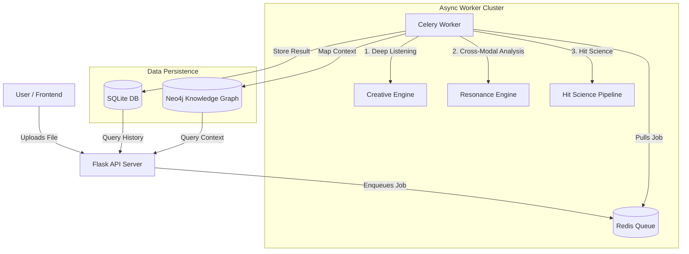

# The Totality Engine

> **A 22-module systems-theoretical optimization engine for music analysis, hit science, and market risk assessment.**
> *Python • Flask • Librosa • Celery • Redis • Neo4j*

The Totality Engine is not just an audio analyzer; it is comprehensive "Hit Science" platform that quantifies the interaction between content (audio/lyrics) and context (market/culture).

## System Architecture



## Core Capabilities

### 1. **Listen & Analyze** (The Creative Engine)
Uses `librosa` and `torch` to extract deep spectral features.
*   **Deep Listening**: Spectral flux, harmonic entropy, beat strength.
*   **Resonance**: Cross-modal analysis comparing Lyrical Sentiment (NLP) vs. Audio Mood.
*   **Vibe Descriptor**: Auto-tags tracks (e.g., "Anthemic Joy", "Melancholic Drift").

### 2. **Systems-Theoretical Optimization** (The Hit Science Pipeline)
A modular pipeline carrying audio data through 6 distinct systems:
*   **Creative System**: Explicitness, Code-Switching, Rhyme Density.
*   **Audience System**: Neuro-marketing metrics (Hook Efficacy, Spectral Burstiness).
*   **Platform System**: Viral Elasticity potential.
*   **Market System**: Risk mapping.
*   **Industry System**: Artist distinctiveness and centrality.
*   **Culture System**: (Planned) Cultural distance.

### 3. **Scale & Context** (The Enterprise Layer)
*   **Async Processing**: High-friction audio analysis is offloaded to background **Celery** workers via **Redis**, ensuring the UI remains instant.
*   **Knowledge Graph**: Results are mapped into a **Neo4j** graph database, linking `(Track)-[:HAS_VIBE]->(Concept)` and `(Artist)-[:PERFORMED]->(Track)` for future recommendation engines.

## Repository Structure

*   `totality_engine/`: The core Python package containing all 22 analysis modules.
*   `server.py`: Flask API gateway.
*   `worker.py`: Celery worker entry point.
*   `tasks.py`: Asynchronous task definitions.
*   `frontend/`: **React (Vite)** Source code for the Single Page Application.
*   `verify_*.py`: Suite of rigorous validation scripts.

> **Full Breakdown**: See [MODULES.md](MODULES.md) for a detailed status report of all 22 engines (Capabilities vs. Limitations).

## Quick Start

The system requires **Redis** (Messaging) and **Neo4j** (Graph) to be running.

### 1. Install Dependencies
```bash
pip install -r requirements.txt
# Ensure Redis and Neo4j are installed (e.g., via Homebrew)
brew install redis neo4j
```

### 2. Start Services (Multi-Terminal)

**Terminal 1: Data Infrastructure**
```bash
redis-server --daemonize yes
neo4j start
```

**Terminal 2: The Brain (Worker)**
```bash
celery -A worker.celery worker --loglevel=info --pool=solo
```

**Terminal 3: The Interface (Server)**
```bash
PORT=5001 python3 server.py
```

### 3. Verify
Run the rigorous module verification suite:
```bash
python3 verify_modules.py
# Output: "Summary: 23/23 modules passed."
```
